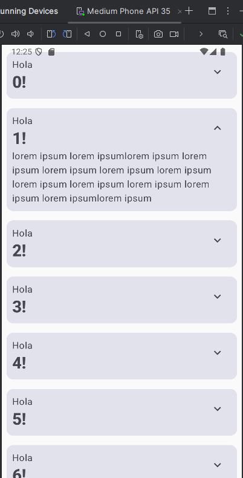

# Práctica 1 - Bases de Jetpack compose

Ejemplo pertenece a: [Jetpack compose Codelab 1](https://developer.android.com/codelabs/jetpack-compose-basics?hl=es-419&continue=https%3A%2F%2Fdeveloper.android.com%2Fcourses%2Fpathways%2Fjetpack-compose-for-android-developers-1%3Fhl%3Des-419%23codelab-https%3A%2F%2Fdeveloper.android.com%2Fcodelabs%2Fjetpack-compose-basics#0)

## Tabla de Contenidos

- [1. 📷 Screenshots](#1--screenshots)
- [2. 📝 Apuntes](#2--apuntes)
  - [2.1. Modifier](#21-modifier)
  - [2.1. Estructuras básicas](#21-estructuras-básicas)
  - [2.2. Sobre Kotlin](#22-sobre-kotlin)
  - [2.3. Hasta ahora para realizar justifyBetween](#23-hasta-ahora-para-realizar-justifybetween)
  - [2.4. Estados en Jetpack Compose](#24-estados-en-jetpack-compose)
  - [2.5. Pasar función de padre a hijo](#25-pasar-función-de-padre-a-hijo)
  - [2.6. Iteraciones en LazyColumn y LazyRow](#26-iteraciones-en-lazycolumn-y-lazyrow)
  - [2.7. Animación SOLO transición para suavizado](#27-animación-solo-transición-para-suavizado)
  - [2.8. Animación con efecto Resorte](#28-animación-con-efecto-resorte)
  - [2.9. Sobre customización en texto](#29-sobre-customización-en-texto)
  - [2.10. Sobre generalización](#210-sobre-generalización)
- [3. Código útil de recordar](#código-útil-de-recordar)

## 1. 📷 Screenshots



## 2. 📝 Apuntes

### 2.1. Modifier

Se recomienda agregar en argumentos de función modifier, para que desde el padre se pueda modificar algún comportamiento del hijo (animaciones, padding, etc)

### 2.1 Estructuras básicas

Column, Row, Box, LazyColumn, LazyRow [revisar documentación](https://developer.android.com/develop/ui/compose/layouts/basics?hl=es-419)

### 2.2. Sobre Kotlin

```kotlin
val names: List<String> = listOf("Mundo", "Ejemplo")
for (name in names)
  // Componente

// Para rellenar un array simil (Array.from({length: 1000}, (_, index) -> index))
val names: List<String> = List(1000) {"$it"}
```

### 2.3. Hasta ahora para realizar justifyBetween

El primer componente de column debe tener en el modifier (.weight(1f)).

### 2.4. Estados en Jetpack compose

- **remember** Recuerda la composición
- **rememberSaveable** Se usa en dos ocasiones:
  - Al girar la pantalla de dispositivo se reinicia la componibilidad.
  - Cuando se hace uso de LazyColumn, LazyRow se pierde el estado debido a virtualización.

```kotlin
/** PRIMER método **/
val estado : MutableState<Boolean> = remember { mutableStateOf(false) }
// asignación
onClick = { estado.value = !estado.value }
// obtención
println(estado.value)

/** SEGUNDO método **/
import androidx.compose.runtime.setValue
import androidx.compose.runtime.getValue

var estado by remember { mutableStateOf(false) }
// asignación
onClick = { estado = !estado }
// obtención
println(estado)
```

### 2.5. Pasar función de padre a hijo

El estado creado desde el padre puede pasar una función que modifique el estado a un hijo.

```kotlin
// En hijo simil( ()=>void )
fun hijo (onClickButton: () -> Unit)

// llamada
ElevatedButton ( onClick = onClickButton ) {...}

// En padre
hijo(onClickButton = { estado = !estado })
```

### 2.6. Iteraciones en LazyColumn y LazyRow

Para virtualizar grandes cantidades de información.

```kotlin
import androidx.compose.foundation.lazy.items

val names : List<String> = List(1000) {"$it"}
LazyColum (...) {
  items (names) {
    elem -> Componente(elem)
  }
}
```

### 2.7. Animación SOLO transición para suavizado

```kotlin
val extraPadding by animateDpAsState(
  if(expanded) 48.dp else 0.dp
)
```

### 2.8. Animación con efecto Resorte

```kotlin
val extraPadding by animateDpAsState(
  if(expanded) 48.dp else 0.dp,
  animationSpec = spring(
    dampingRatio = Spring.DampingRatioMediumBouncy,
    stiffness = Spring.StiffnessLow
  )
)

// Se debe tener cuidado con el efecto resorte ya que puede dar valores < a 0.dp
extraPadding.coerceAtLeast(0.dp)
```

### 2.9. Sobre customización en texto

Si tienes un texto y quieres modificar su peso podrías hacer lo siguiente:

```kotlin
Text("Hola", style =  TextStyle(fontWeight = FontWeight.ExtraBold))
```

Pero no se recomienda debido a que si en lugar de el tamaño de fuente se cambiara el color de texto se tendría problemas cuando el dispositivo tenga modo noche, **se recomienda copiar y recien modificar**

```kotlin
Text("Hola", style = MaterialTheme.typography.headlineMedium.copy(
  fontWeight = FontWeight.ExtraBold
))
```

### 2.10 Sobre generalización

Existe cierta práctica común a la hora de customizar tonos en un Button, Card, IconButton y es colors, ejemplos:

```jetpack
Card(
  colors = CardDefaults.cardColors(),
)

ElevatedButton(
  colors = ButtonDefaults.elevatedButtonColors(
    containerColor = MaterialTheme.colorScheme.primary,
    contentColor = MaterialTheme.colorScheme.onPrimary
  )
)

```

## 3. Código útil de recordar

```kotlin
// Iconos extendidos
implementation("androidx.compose.material:material-icons-extended")

IconButton(onClick = { expanded = !expanded }) {
  Icon(
    imageVector = if (expanded) Icons.Filled.ExpandLess else Icons.Filled.ExpandMore,
    contentDescription = if (!expanded) stringResource(R.string.show_more) else stringResource(R.string.show_less)
  )
}

// Centrar
Column(
  modifier.fillMaxSize(),
  verticalArrangement = Arrangement.Center,
  horizontalAlignment = Alignment.CenterHorizontally
)
```
